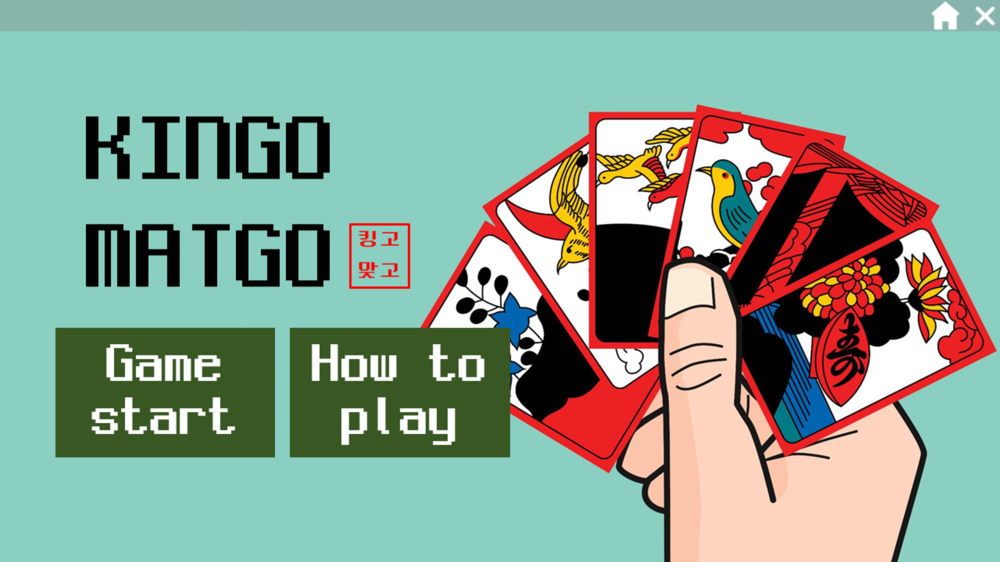
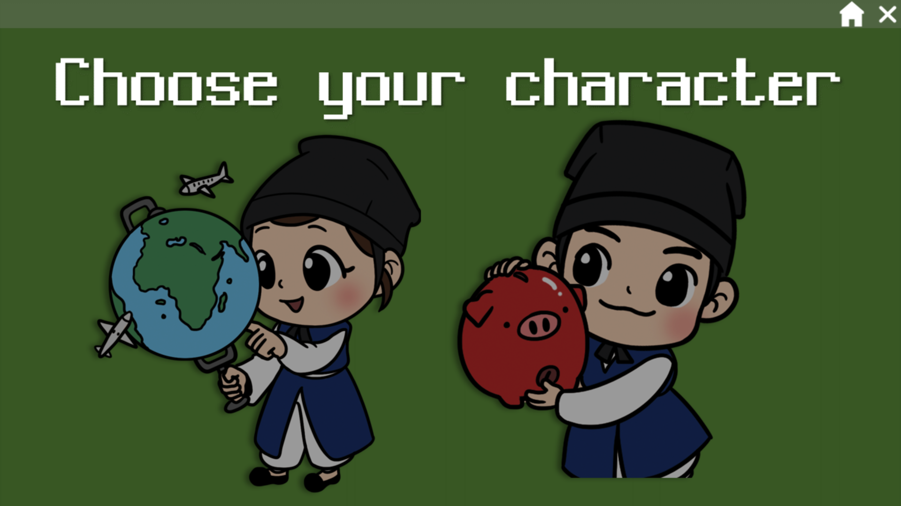
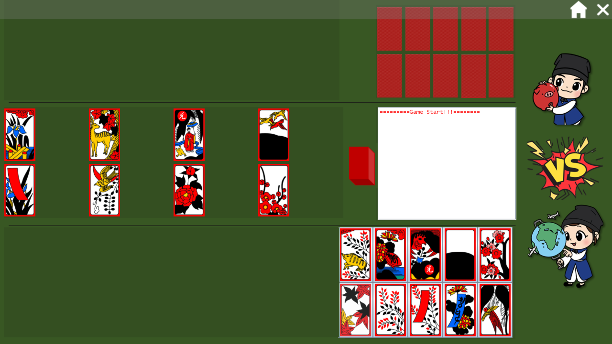
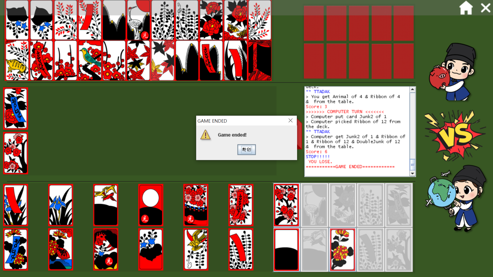
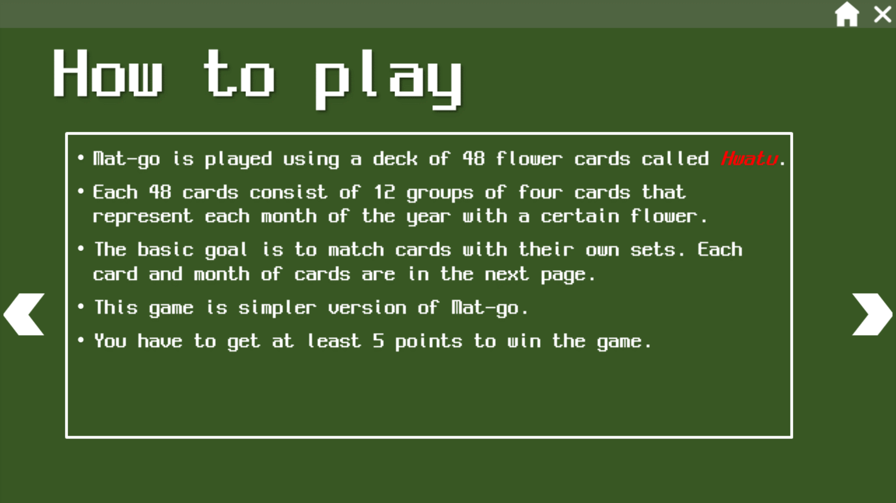
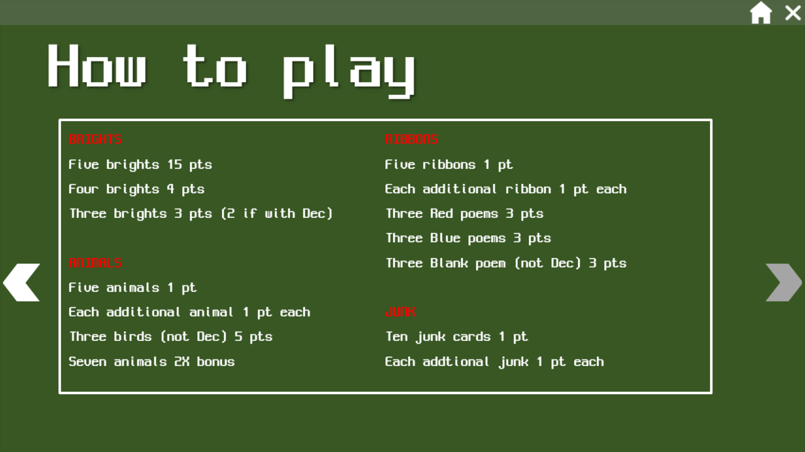

# Kingo Matgo
KINGO MATGO is Matgo(***맞고*** in Korean) game implemented with Java GUI Swing.

## Environment
-	Language: Java
-	IDE: Eclipse IDE

## Screenshot
### Main page

### Character choice page

### Initial Game page

### Game end page

### How to play page

## To be implemented
- [ ] Make table cards arranged
- [ ] Implement junk card exchange when TTadak(***따닥***), Sseul(***쓸***) etc
- [ ] Add animation on cards
- [ ] Implement more complete rules in cacultaing scores like Pi-bak(***피박***), Gwang-bak(***광박***) etc
- [ ] Refactoring (Especially, MatgoGame.java)
